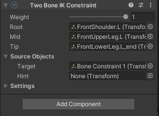
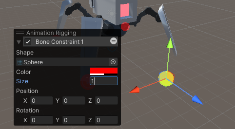
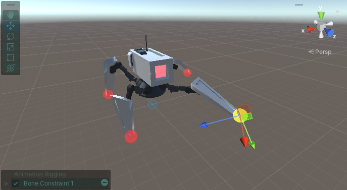
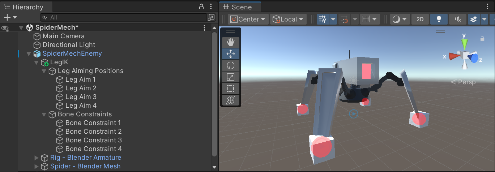
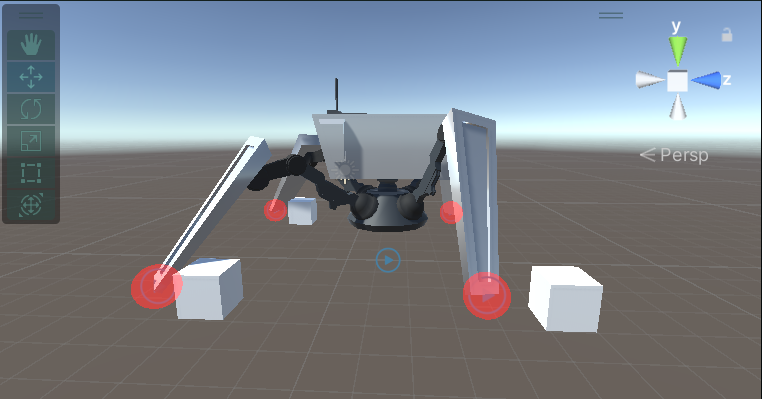

# Lab – Intermediate Slice – Spider Sentinels (Part 1: Programming)

*In this lab, you’ll start building a procedural animation system for spider-like creatures, controlling a 3D armature directly with code.*


---

### Additional Notes & Documentation

#### SpiderMechEnemy.fbx  
For this lab, start with the provided **`SpiderMechEnemy.fbx`** in the `Meshes` folder.  

In future weeks, you’ll create your own custom spider enemy. When exporting from Blender:  
- Use a **standard armature** (no IK or constraints).  
- Export as `.fbx` and import into Unity.  
- Double-check the armature bones so you’re working with the correct setup.

#### Refactoring & Temp Code  
Some code in this lab is temporary and will be replaced later. It focuses on quick testing, not best practices.  
- You may refactor as you go.  
- Keep notes of changes so later lab steps still align with your project.

#### Documentation  
[Unity Docs – Animation Rigging](https://docs.unity3d.com/Packages/com.unity.animation.rigging@1.3/manual/index.html)

---

### Section 1 – Setting up IK in Unity

1. Install the Unity **`Animation Rigging`** package in your project.  
2. Select the `.fbx` in your scene and go to:  
   `Top Menu > Animation Rigging > Rig Setup`  
   > This adds a new Empty to the scene (the Unity rig) and automatically attaches **Animator** and **Rig Builder** components to the parent object.  
3. Rename the Unity rig to something descriptive, e.g. **`LegIK`**.  
4. Add a child to `LegIK` and name it **`Bone Constraint`** (or similar).  
5. Add a **Two Bone IK Constraint** component to `Bone Constraint` and configure it:  

```
Weight = 1
Root = Top bone in the leg (FrontShoulder.L)
Mid = Middle bone in the leg (FrontLegUpper.L)
Tip = Final bone in the leg (FrontLegLower.L_end)
Source Objects > Target = Bone Constraint
```



6. In the Scene view, expand the **Animation Rigging floating window**.  
   - Set **Shape = Sphere**  
   - Set **Size = 1**  
   > This gives a visual indicator for the IK target.  



7. Align the `Bone Constraint` object with the tip of the leg:  

```
Hierarchy > Select "Bone Constraint"
Hierarchy > Ctrl+Click "FrontLegLower.L_end"
Top Menu > Animation Rigging > Align Transform
```

> The IK target now inherits the local transform of the bone tip. Keeping objects aligned in local 3D space is critical in this workflow.  

8. Run the game to test the IK:  
   - Move the IK target in the Scene view.  
   - The leg should follow.  
   > If it doesn’t behave correctly, double-check your **Two Bone IK Constraint** settings and confirm you used **Align Transform**.  

9. Duplicate the `Bone Constraint` until you have one for each leg (e.g. 4).  
10. Rename them clearly: **`Bone Constraint 1/2/3/4`**.  
11. Test the IK on all legs.  



---

You’ve now added IK constraints to the Blender armature. Wherever the IK targets (`Bone Constraint 1/2/3/4`) are placed in 3D space, the leg bones will attempt to reach them (limited by bone length).

---

# Take a Break

Pause here and consider the next challenge:  

*How can we keep the IK targets perfectly still while the body moves?*  
(Remember: the IK constraints are children of the spider character, so this is trickier than it sounds.)

> **Why this matters:** The goal is to keep legs grounded until they *must* move. Step one is locking the feet while the body moves. Later, we’ll decide when and where the feet should step next.

---

### Section 2 – Locking IK Targets in Place

We’ll write a small script for each IK target that re-applies its own `transform.position` in `Update()`. This pins the target so it stays put even when its parent moves.

1. Create a new script named **`BoneConstraintController`**.  
2. Try writing it yourself before checking the example.  
3. Add the script to every **Bone Constraint** object, then test by moving the character around.  
4. If you get stuck, expand the example below to compare.  

<details>
<summary>💡 Example Solution (click to expand)</summary>

```csharp
using UnityEngine;

public class BoneConstraintController : MonoBehaviour
{
    private Vector3 currentIKPos;

    void Start()
    {
        currentIKPos = transform.position;
    }

    void Update()
    {
        transform.position = currentIKPos;
    }
}
```
</details>

---

# Take a Break

Consider the next challenge:  

**How can we define an ideal resting point for each leg** so that, as the character moves, we automatically generate a target in 3D space where that foot should step? This target should update dynamically with the scene so each foot can aim higher or lower when traversing obstacles.

> **Why this matters:** Without terrain-aware targets, feet will clip through geometry when climbing or stepping over objects.

---

### Section 3 – Adding Leg Aiming

Next, we’ll set up a basic leg aiming/grounding system. In this first pass, use cubes to mark each leg’s **ideal resting location**.

1. Create **4 cubes** named **`Leg Aim 1/2/3/4`**. These correspond to **`Bone Constraint 1/2/3/4`**.  
2. Use **Animation Rigging** tools to align the **position (not rotation)** of each `Leg Aim` to its matching `Bone Constraint`:  

```
Hierarchy > Select "Leg Aim 1"
Hierarchy > Ctrl+Click "Bone Constraint 1"
Top Menu > Animation Rigging > Align Position

...Repeat for all 4 legs
```

3. Make the **Leg Aim objects** children of the **`LegIK`** GameObject and tidy the hierarchy as you like.  



> Optional cleanup: You can add empty parent objects to group **Leg Aim** and **Bone Constraint** objects. Renaming your original `Rig`/`Spider` trees to indicate they’re the Blender armature/mesh can also clarify that **`LegIK`** contains all Unity-based procedural animation.

4. Run the game to verify:  
   - **Leg Aim** cubes move with the character body.  
   - Feet remain pinned to the ground (from Section 2).  
   - The white cubes indicate where the legs will try to move next.  



---

# Take a Break

Think about the next challenge:  

- **When and how should we update a leg’s position** once its **Leg Aim** object gets far enough away?

---

### Section 4 – Updating Leg Positions

We’ll extend `BoneConstraintController` to measure the distance between the current IK position and its leg aim. When that distance exceeds a threshold, we’ll **snap** the IK to the new aim.

**Goal:**  
- Compute `currentStepDistance = distance(currentIKPosition, legAimPosition)`.  
- If `currentStepDistance > maxStepDistance` → update `currentIKPosition` to the aim.  
- Otherwise, keep the foot where it is.

1. **Add fields** to `BoneConstraintController`:  
   - `legAimPosition` (**GameObject**)  
   - `maxStepDistance` (**float**)  
   - `currentStepDistance` (**float**, private)  
   - `currentIKPosition` (**Vector3**, private)  
   > If you previously named this `currentIKPos`, keep your naming consistent.

2. **Create** a `SetIKPosition()` method:  
   - Use `Vector3.Distance()` to calculate `currentStepDistance`.  
   - If distance > `maxStepDistance`, snap to the new position.  
   - Otherwise, reapply the current position.

3. **Call** `SetIKPosition()` from `Update()`.  

4. **Wire up in Inspector:**  
   - Assign each **Leg Aim 1/2/3/4** to the matching **Bone Constraint 1/2/3/4**.  
   - Set **Max Step Distance = 2**.  
   - *(Screenshot: Referencing the Leg Aims in the Inspector)*  

5. **Test:**  
   Move the spider around. Each IK leg should **jump** to its new aim once the distance is large enough.  
   > If it’s not working, confirm all **Leg Aims** are assigned and `maxStepDistance` is set.

<details>
<summary>💡 Example Solution (click to expand)</summary>

```csharp
using UnityEngine;

public class BoneConstraintController : MonoBehaviour
{
    public GameObject legAimPosition;
    public float maxStepDistance = 2f;

    private float currentStepDistance;
    private Vector3 currentIKPosition;

    void Start()
    {
        currentIKPosition = transform.position;
    }

    void Update()
    {
        SetIKPosition();
    }

    private void SetIKPosition()
    {
        currentStepDistance = Vector3.Distance(currentIKPosition, legAimPosition.transform.position);

        if (currentStepDistance > maxStepDistance)
        {
            currentIKPosition = legAimPosition.transform.position;
        }
        else
        {
            transform.position = currentIKPosition;
        }
    }
}
```
</details>

---

### Lab Summary

In this session you built the **core foundations** of a procedural animation controller for spider-like legs.  

- Locked IK targets in place so they don’t move with the body.  
- Introduced **Leg Aim** markers to define where feet *should* step.  
- Implemented simple step logic where legs snap to their aims once the distance threshold is exceeded.  

At this point, the rig works best on flat ground. The legs can snap to new positions, but they don’t yet adapt to terrain or move smoothly.  

---

### Next Steps in Future Lab Sessions

**Lab Part 2**  
- Ground detection with raycasts.  
- Keeping Leg Aims aligned with terrain (steps, slopes, uneven ground).  
- Fixing the raycast origin bug.  

**Lab Part 3**  
- Coordinating legs so they don’t all move at once (e.g. alternating opposites).  
- Smoother step logic: legs lifting and moving across an arc rather than snapping.  

**Lab Part 4**  
- Adding dynamic motion profiles (e.g. slow lift, fast drop).  

**Lab Part 5**  
- Adjusting the body’s rotation and position based on current leg placements.  
- Handling steeper terrain and transitions to vertical walls.  

**Lab Part 6+**  
- Expanding the system into gameplay:  
  - Polishing animations.  
  - Building encounters or challenges that use the spider enemies.  
  - Turning the rig into a fully playable or AI-driven mechanic.

