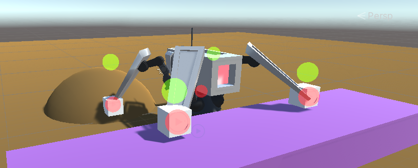

# Lab – Intermediate Slice – Spider Sentinels (Part 1: Programming)

*In this lab, you’ll start building a procedural animation system for spider-like creatures, controlling a 3D armature directly with code.*


---

### Additional Notes & Documentation

#### SpiderMechEnemy.fbx  
For this lab, start with the provided **`SpiderMechEnemy.fbx`** in the `Meshes` folder.  

In future weeks, you’ll create your own custom spider enemy. When exporting from Blender:  
- Use a **standard armature** (no IK or constraints).  
- Export as `.fbx` and import into Unity.  
- Double-check the armature bones so you’re working with the correct setup.

#### Refactoring & Temp Code  
Some code in this lab is temporary and will be replaced later. It focuses on quick testing, not best practices.  
- You may refactor as you go.  
- Keep notes of changes so later lab steps still align with your project.

#### Documentation  
[Unity Docs – Animation Rigging](https://docs.unity3d.com/Packages/com.unity.animation.rigging@1.3/manual/index.html)

--- 

### Section 1 – Setting up IK in Unity

1. Install the Unity **`Animation Rigging`** package in your project.  
2. Select the `.fbx` in your scene and go to:  
   `Top Menu > Animation Rigging > Rig Setup`  
   > This adds a new Empty to the scene (the Unity rig) and automatically attaches **Animator** and **Rig Builder** components to the parent object.  
3. Rename the Unity rig to something descriptive, e.g. **`LegIK`**.  
4. Add a child to `LegIK` and name it **`Bone Constraint`** (or similar).  
5. Add a **Two Bone IK Constraint** component to `Bone Constraint` and configure it:  

```

Weight = 1
Root = Top bone in the leg (FrontShoulder.L)
Mid = Middle bone in the leg (FrontLegUpper.L)
Tip = Final bone in the leg (FrontLegLower.L_end)
Source Objects > Target = Bone Constraint

```


6. In the Scene view, expand the **Animation Rigging floating window**.  
- Set **Shape = Sphere**  
- Set **Size = 1**  
> This gives a visual indicator for the IK target.  


7. Align the `Bone Constraint` object with the tip of the leg:  
```

Hierarchy > Select "Bone Constraint"
Hierarchy > Ctrl+Click "FrontLegLower.L_end"
Top Menu > Animation Rigging > Align Transform

```
> The IK target now inherits the local transform of the bone tip. Keeping objects aligned in local 3D space is critical in this workflow.  

8. Run the game to test the IK:  
- Move the IK target in the Scene view.  
- The leg should follow.  
> If it doesn’t behave correctly, double-check your **Two Bone IK Constraint** settings and confirm you used **Align Transform**.  

9. Duplicate the `Bone Constraint` until you have one for each leg (e.g. 4).  
10. Rename them clearly: **`Bone Constraint 1/2/3/4`**.  
11. Test the IK on all legs.  


---

You’ve now added IK constraints to the Blender armature. Wherever the IK targets (`Bone Constraint 1/2/3/4`) are placed in 3D space, the leg bones will attempt to reach them (limited by bone length).

---
# Take a Break

Pause here and consider the next challenge:  

*How can we keep the IK targets perfectly still while the body moves?*  
(Remember: the IK constraints are children of the spider character, so this is trickier than it sounds.)

> **Why this matters:** The goal is to keep legs grounded until they *must* move. Step one is locking the feet while the body moves. Later, we’ll decide when and where the feet should step next.
---

### Section 2 – Locking IK Targets in Place

We’ll write a small script for each IK target that re-applies its own `transform.position` in `Update()`. This pins the target so it stays put even when its parent moves.

1. Create a new script named **`BoneConstraintController`**.
2. Try writing it yourself before checking the example.
3. Add the script to every **Bone Constraint** object, then test by moving the character around.
4. Compare your solution against the example below.

```csharp
using System.Collections;
using System.Collections.Generic;
using UnityEngine;

public class BoneConstraintController : MonoBehaviour
{
    private Vector3 currentIKPos;
    // Start is called before the first frame update
    void Start()
    {
        currentIKPos = transform.position;
    }

    // Update is called once per frame
    void Update()
    {
        transform.position = currentIKPos;
    }
}
```

---

# Take a Break

Consider the next challenge:

**How can we define an ideal resting point for each leg** so that, as the character moves, we automatically generate a target in 3D space where that foot should step? This target should update dynamically with the scene so each foot can aim higher or lower when traversing obstacles.

> **Why this matters:** Without terrain-aware targets, feet will clip through geometry when climbing or stepping over objects.

---


### Section 3 – Adding Leg Aiming

Next, we’ll set up a basic leg aiming/grounding system. In this first pass, use cubes to mark each leg’s **ideal resting location**.

1. Create **4 cubes** named **`Leg Aim 1/2/3/4`**. These correspond to **`Bone Constraint 1/2/3/4`**.
2. Use **Animation Rigging** tools to align the **position (not rotation)** of each `Leg Aim` to its matching `Bone Constraint`:
```

Hierarchy > Select "Leg Aim 1"
Hierarchy > Ctrl+Click "Bone Constraint 1"
Top Menu > Animation Rigging > Align Position

...Repeat for all 4 legs

```
3. Make the **Leg Aim objects** children of the **`LegIK`** GameObject and tidy the hierarchy as you like.


> Optional cleanup: You can add empty parent objects to group **Leg Aim** and **Bone Constraint** objects. Renaming your original `Rig`/`Spider` trees to indicate they’re the Blender armature/mesh can also clarify that **`LegIK`** contains all Unity-based procedural animation.

4. Run the game to verify:
- **Leg Aim** cubes move with the character body.
- Feet remain pinned to the ground (from Section 2).
- The white cubes indicate where the legs will try to move next.


---

# Take a Break

Think about the next challenge:

- **When and how should we update a leg’s position** once its **Leg Aim** object gets far enough away?

---


### Section 4 - Updating the Leg Positions
In this next part we will update the `BoneConstraintController` to measure the distance between the `currentIKPosition` and the `legAimPosition` - we'll call this variable `currentStepDistance`. Once `currentStepDistance` becomes greater than our `maxStepDistance`, we will set the `currentIKPosition` equal to the `legAimPosition` - snapping it to its new location

* Update the `BoneConstraintController` to include new variables
```csharp
 public GameObject legAimPosition;
 public float maxStepDistance;
 private float currentStepDistance;
 private Vector3 currentIKPosition;
```

* Create a new method named `SetIKPosition()` within `BoneConstraintController`
* Use `Vector3.Distance()` to calculate `currentStepDistance`
* Use an `if/else` to manage logic to move to the new `legAimPosition` when the `currentStepDistance` is larger than `maxStepDistance`, else stay stationary.

```csharp
private void SetIKPosition()
{
    // Find current step distance
    currentStepDistance = Vector3.Distance(currentIKPosition, legAimPosition.transform.position);
    if (currentStepDistance > maxStepDistance )
    {
        currentIKPosition = legAimPosition.transform.position;
    }
    else
    {
        transform.position = currentIKPosition;
    }
}

```

* Call `SetIKPosition()` inside of `Update()`

```csharp
void Update()
{
  SetIKPosition();
}
```
* Drag the `Leg Aim 1/2/3/4` objects into the `Leg Aim Position` fields within the `BoneConstraintsController` component on each corresponding `Bone Constraint 1/2/3/4` object
* Set the `Max Step Distance` to `2`


* Test the game now to see if these behaviors are working as expected. These additions should now allow you to move the spider character around, and the IK legs should jump to the new position after the distance becomes large enough.

> If you are not seeing these behaviors, go through and confirm all of your Leg Aims have been added referenced in the Inspector of the Bone Constraint objects. Make sure you have set a Max Step Distance

# Take a Break
Take a break and think about how you would work on the next challenge:
* Making sure that the legs are always detecting the ground and following the profile of the ground


### Section 5 - Adding Leg Grounding

In this next section we will check for grounding. We want to make sure that the `Leg Aim Objects` are `detecting the ground` and are always `sitting above it`. If a Leg Aim detects ground below its current position, it should update the position to move down to it. We will also use an offset in the y axis in checking for the ground so that find the correct higher level when walking up slopes.

* Create a script named `LegGrounding`
* Create variables for the new behaviours
```csharp
private int layerMask;
public Vector3 groundingOffset = new Vector3(0f,0.75f,0f);
```
* In `Start()` find the `LayerMask` for `Ground`

```csharp
void Start()
    {
        layerMask = LayerMask.GetMask("Ground"); // Get the ground mask
    }
```
* In `Update()` cast a Ray from the Leg Aim Object downwards (including a buffer of `groundingOffset`), checking for collisions on the `layerMask`, if a collision is detected, move the `Leg Aim object` to the `hit.point`
```csharp 
void Update()
    {
        // Shoot a raycast out from below the Leg Aim cube to find the ground
        RaycastHit hit;
        if (Physics.Raycast(transform.position + groundingOffset, -transform.up, out hit, Mathf.Infinity, layerMask))
        {
            // if we have found a ground layer, move the cube to the hit point (with the offset added)
            transform.position = hit.point + groundingOffset;
        }
    }


```

Next we need to address an edge case bug. If there is a groundlayer object below the ground we are currently on and we walk off to it, we will not be able to walk back up from it.

> Why? The ray is cast directly from the Leg Aim Object (plus a small vertical offset), when it finds the "new" ground below itself, it moves the Leg Aim Object down into position, so now the raycast is coming from this new grounded position, and can never detect things higher than itself.

To resolve this we want to cast our ray from a parent empty that is at the max height of the legs, not from the leg aim object itself. First try to do this without using the example below. Thing about the things we need to change:
* We need to reference a new object that the Raycast should originate from for each leg
* We need a parent/child relationship so that the Raycast origin stays with the spider, not the Leg Aim object
* We need to update the LegGrounding script to use the new Raycast origin

```csharp
// Changes to Variables
public GameObject raycastOrigin;

//Changes to Start()
raycastOrigin = transform.parent.gameObject;

//Changes to Update()
if (Physics.Raycast(raycastOrigin.transform.position + groundingOffset, -transform.up, out hit, Mathf.Infinity, layerMask))
```
> You will then need to give each leg aim an new `Empty Parent`, align position to the corresponding leg using the `Animation Rigging Menu` and set it's transform to have a suitable Y value. Using the `Animation Rigging floating window` to add some visual indicators for these is a good idea. In the example below i have created green spheres to indicate the raycast origins


Build out some basic obstacles to test the rig, we should now be able to handle low steps and slopes of uneven terrain, and be able to get back up if we drop down to a lower step. 



However, Our entire IK system still relies on the position and rotation of the main body as it's parent, so if we try to ascend to terrain that is higher than our body, we will begin to clip, through, and eventually our raycastOrigin objects will be below the slope and will snap to objects below.


As we build out further functionality to the rig we will need a way to normalize our body position and rotation from the current position of each leg. But for this lab we will focus on getting a good base level of movement on uneven terrain. lets get each leg moving to the new position in sequence where each leg waits for it's opposite to stop moving.

# Take a Break
Take a break and think about how you would work on the next challenge:
* Moving the legs only if the opposite leg is not moving.

### Section 6 - Checking if the Opposite Leg is Moving

* In `BoneConstraintController` we will tidy up the existing variables and add a new reference to the opposite leg's `BoneConstraintController` and a bool for `legIsMoving`

```csharp
// Position/Distance variables
public GameObject legAimPosition;
private float currentStepDistance;
private Vector3 currentIKPosition;

// Step Attributes
public float maxStepDistance;

// Step sequencing variables
public BoneConstraintController oppositeLeg;
private bool legIsMoving;
```

* Next we will create a new `CheckIsMoving()` method which we will use to `return the legIsMoving bool` from the oppositeLeg

```csharp
public bool CheckIsMoving()
{
  return legIsMoving;
}
```

* Add an additional condition to the `if statement` within `SetIKPosition()` method to call `CheckIsMoving()` on the `oppositeLeg` and return when `oppositeLEg.legIsMoving` is false.

```csharp
private void SetIKPosition()
{
    // Find current step distance
    currentStepDistance = Vector3.Distance(currentIKPosition, legAimPosition.transform.position);
    // Check the current distance against the max distance AND check if the opposite leg is  moving
    if (currentStepDistance > maxStepDistance && !oppositeLeg.CheckIsMoving())
    {
      // Set legIsMoving to true, transform.position to the new leg aim position, update currentIK position to the new position
        legIsMoving = true;
        transform.position = legAimPosition.transform.position;
        currentIKPosition = transform.position;
        
    }
    else
    {
      // if we dont need to or arent able to move yet, set legIsMoving to false, set transform.position to currentIKposition
        legIsMoving = false;
        transform.position = currentIKPosition;
        
    }
}
```
* Set the references to the `Opposite leg (BoneConstraintController)` for each `Bone Constraint 1/2/3/4` object in the inspector.
> In my implementation the front legs are 1/2 and rear legs 3/4, so i have the following references
> * 1 --Opposite Leg-- 2
> * 2 --Opposite Leg-- 1
> * 3 --Opposite Leg-- 4
> * 4 --Opposite Leg-- 3
> Your implementation may differ depending on how you set up your legs


* Run the program and test the rig, each leg should now move in sequence separately to it's opposite counterpart.

### Lab Summary
We have implemented the fundamentals for this type of procedural animation controller, and assuming a flat terrain or flat terrain with small uneven details, this controller, and a wide camera perspective such as an isometric view to mostly obscure the legs snapping to new positions rather than animating smoothly across an arc; this may be functional enough to implement into gameplay. For this lab however, we will be improving this controller with a lot more functionality, an overview of the next problems to solve are below:

**Lab Part 2**
* AI Navmesh to auto-follow the player
* Legs moving to new positions over time
* Legs lifting up and over to new positions over time within constraints
* Legs moving with dynamic control (e.g a Slow rise and a fast fall)

**Lab Part 3**
* Body adjusting rotation and position based on the leg positions
* Finding and compensating the body position and rotation transitioning to vertical or near vertical walls

**Lab Part 4**
* Turning the mechanic into a game


<details>
<summary>💡 Hint / Example Code (click to expand)</summary>

```csharp
public class Example : MonoBehaviour {
    void Update() {
        Debug.Log("This is hidden by default.");
    }
}


