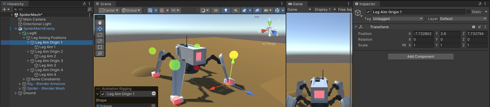
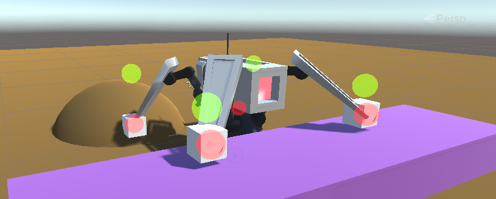
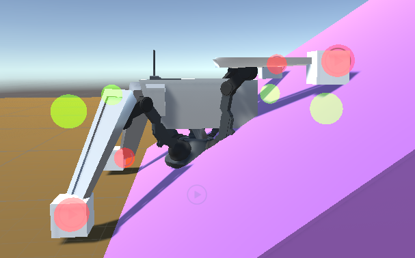

# Lab – Intermediate Slice – Spider Sentinels (Part 2: Grounding & Terrain)

*In this lab, you’ll make the legs terrain-aware: detecting ground with raycasts, keeping Leg Aims aligned to steps/slopes/uneven ground, and fixing a raycast origin bug from the simple approach.*


---

### Quick Recap (from Part 1)
- IK constraints added and **IK targets** locked in place.  
- **Leg Aim** cubes created to mark ideal resting locations.  
- Simple **step trigger**: legs snap to aims when distance exceeds a threshold.

---


### Additional Notes & Documentation

#### Ground & Terrain Setup  
For this lab, you’ll need a **Ground** layer assigned to all walkable surfaces in your scene.  
- Apply this layer to all floor, terrain, or obstacle meshes with **colliders**.  
- This ensures your **raycasts** correctly detect the ground when snapping Leg Aims to the surface.

> **Tip:** Avoid using Mesh Colliders on high-poly terrain. Wherever possible, use **Box**, **Capsule**, or **Terrain Colliders** for better performance.

#### Raycasting in Unity  
We’re using **Physics.Raycast()** to detect the ground below each leg.  
A raycast is an invisible line that projects in a direction and reports what it hits.
You can use Raycast Debugging to visualize the Ray in the scene view.
You can customize it with a **LayerMask** to only detect specific objects.  

Example syntax:  
```csharp
if (Physics.Raycast(origin, direction, out hit, maxDistance, layerMask))
{
    // Code runs when the ray hits something on that layer
}
````

Common parameters:

| Parameter     | Description                                                                   |
| ------------- | ----------------------------------------------------------------------------- |
| `origin`      | Starting point of the ray (e.g. the leg or a parent “raycast origin”).        |
| `direction`   | Usually `Vector3.down` to check below.                                        |
| `out hit`     | Stores information about what the ray hit (position, normal, collider, etc.). |
| `maxDistance` | Maximum length of the ray (can be large like `Mathf.Infinity`).               |
| `layerMask`   | Restricts what layers the ray interacts with.                                 |

#### Refactoring & Temp Code

Like Part 1, some solutions here are intentionally simple for clarity. Later sessions will refactor this system to:

* Smooth foot movement over time.
* Average multiple raycast hits for more stable results.
* Blend between body and leg heights dynamically.

Keep comments and make note of any small adjustments you apply (offset values, layer names, collider tweaks, etc.) so you can reference them in later labs.

#### Documentation

* [Unity Docs – Physics.Raycast](https://docs.unity3d.com/ScriptReference/Physics.Raycast.html)
* [Unity Docs – LayerMask](https://docs.unity3d.com/ScriptReference/LayerMask.html)
* [Unity Docs – Colliders Overview](https://docs.unity3d.com/Manual/CollidersOverview.html)

---

### Section 1 – Add a Grounding Script to Leg Aims

We’ll make each Leg Aim “stick” to the ground by raycasting downward and moving to the hit point (with a small vertical offset so it doesn’t clip).

1. Create a new script named **`LegGrounding`**.
2. Add it to each **Leg Aim** object (1/2/3/4).
3. Configure a small upward offset (e.g., `y = 0.75`) to prevent clipping.

<details>
<summary>💡 Example: LegGrounding (click to expand)</summary>

```csharp
using UnityEngine;

public class LegGrounding : MonoBehaviour
{
    private int layerMask;
    public Vector3 groundingOffset = new Vector3(0f, 0.75f, 0f);

    void Start()
    {
        // Only hit ground colliders
        layerMask = LayerMask.GetMask("Ground");
    }

    void Update()
    {
        // Raycast down from just above the Leg Aim to find the ground
        RaycastHit hit;
        if (Physics.Raycast(transform.position + groundingOffset, -transform.up, out hit, Mathf.Infinity, layerMask))
        {
            // Snap Leg Aim to the ground with the offset applied
            transform.position = hit.point + groundingOffset;
        }
    }
}
```
</details>

> **Why this matters:** Without terrain-aware Leg Aims, feet will snap to positions that float or clip through geometry.

---

# Take a Break

Think ahead:  
- What happens if the raycast **starts from below** a higher ledge? Can the leg ever “find” the higher ground again?

---

### Section 2 – Fix the Raycast Origin Bug

**Problem:** If a Leg Aim snaps down to lower ground, future raycasts originate from that lower position — they can’t detect higher platforms/steps above.

**Solution:** Cast the ray **from a stable parent** (a higher, fixed origin) instead of the Leg Aim itself.

1. For each **Leg Aim**: create a new **Empty Parent** as its parent (e.g., **`Raycast Origin 1/2/3/4`**).  
2. Use **Animation Rigging** to align the parent’s **position** with the related leg (not rotation), then raise the **Y** slightly so it sits at the **maximum leg height**.  
   ```
   Hierarchy > Select "Raycast Origin 1"
   Hierarchy > Ctrl+Click the matching leg bone or reference
   Top Menu > Animation Rigging > Align Position
   ```
3. (Optional) In the **Animation Rigging floating window**, set **Shape = Sphere**, **Size = 1** to visualize each origin.
4. Update **`LegGrounding`** to raycast from the parent instead of the Leg Aim.



<details>
<summary>💡 Example: Updated LegGrounding (click to expand)</summary>

```csharp
using UnityEngine;

public class LegGrounding : MonoBehaviour
{
    private int layerMask;
    public Vector3 groundingOffset = new Vector3(0f, 0.75f, 0f);

    // New: cast from this object (the parent), not from the Leg Aim
    public GameObject raycastOrigin;

    void Start()
    {
        layerMask = LayerMask.GetMask("Ground");

        // If not set in Inspector, default to this object's parent
        if (raycastOrigin == null && transform.parent != null)
        {
            raycastOrigin = transform.parent.gameObject;
        }
    }

    void Update()
    {
        RaycastHit hit;
        Vector3 origin = (raycastOrigin != null ? raycastOrigin.transform.position : transform.position);
        if (Physics.Raycast(origin + groundingOffset, -transform.up, out hit, Mathf.Infinity, layerMask))
        {
            transform.position = hit.point + groundingOffset;
        }
    }
}
```
</details>

> After updating the script, assign each **Leg Aim**’s **`raycastOrigin`** in the Inspector (its Empty Parent).

---

# Take a Break

Reflect:  
- With a higher, stable origin, the Leg Aim can now “see” steps above its current position. What other cases might still fail (e.g., overhangs)?

---

### Section 3 – Build a Terrain Test Course

Let’s validate behavior on uneven ground.

1. In your scene, create a simple **obstacle course**:
   - Low steps (10–30 cm).
   - Gentle slopes.
   - A small drop to a lower platform and a path back up.
2. Ensure all meshes have **colliders** and are on the **Ground** layer.
3. Play the scene and move the spider:
   - Leg Aims should **track** the terrain and remain slightly above it.
   - After stepping down, they should still detect higher ground via the **raycast origin**.



> If Leg Aims jitter, try a slightly larger `groundingOffset.y` or smooth their motion in a future session (we’ll handle interpolation later).

---

### Section 4 – Known Limitations (for Now)

As the body climbs, the parented nature of the current rig can cause:
- **Clipping** when the main body is lower than upcoming terrain.
- **Raycast origins** eventually sitting **below** steep slopes or walls, causing snaps to geometry underneath.



> We’ll address this in later labs by normalizing the body pose from multiple leg contacts and improving step planning.

---

### Lab Summary

In this session, you extended your spider’s procedural animation system to make it **terrain-aware**.  

- Implemented **raycast-based grounding** to detect surfaces below each leg.  
- Ensured **Leg Aims** always align to the ground, adjusting dynamically across steps and slopes.  
- Solved the **raycast origin bug** by introducing stable parent objects to cast from, allowing legs to “see” higher terrain again.  
- Tested the rig across uneven environments and confirmed reliable contact on varying ground heights.  

Your spider can now walk over uneven terrain without its feet floating or clipping through geometry, establishing the groundwork for more advanced movement logic in future sessions.

---

### Next Steps in Future Lab Sessions

**Lab Part 3**  
- Coordinating leg movement so paired legs alternate (no simultaneous stepping).  
- Introducing smooth step arcs for more natural leg motion.  

**Lab Part 4**  
- Refining foot motion profiles (e.g. slow lift, fast drop).  
- Implementing interpolation and easing for step transitions.  

**Lab Part 5**  
- Adjusting body height and rotation dynamically based on leg contact points.  
- Maintaining stable body posture over uneven terrain.  

**Lab Part 6+**  
- Expanding to gameplay systems:  
  - Integrating navigation (NavMesh or AI movement).  
  - Polishing procedural animations and timing.  
  - Preparing the full system for player or AI-controlled spiders.

